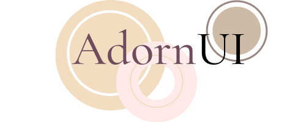
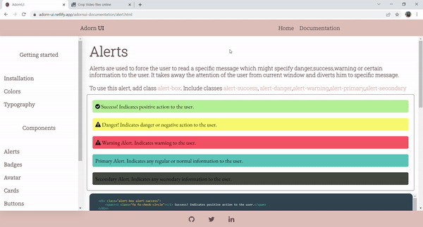

# Adorn-UI - CSS Component Library to build beautiful UIs easily.



### Adorn UI is an easy to use CSS component library supporting many of the most frequently used components.





## Tech stack
HTML 
CSS 
JavaScript

## Installation
Put the below link in the head tag of your HTML code and copy paste the code for desired component in your code.

```
<link rel="stylesheet" href="https://adorn-ui.netlify.app/../AdornUi-Stylesheets/AdornUi.css">
```

 


## Show your support
⭐ this repository if you really like it!

Happy coding!
